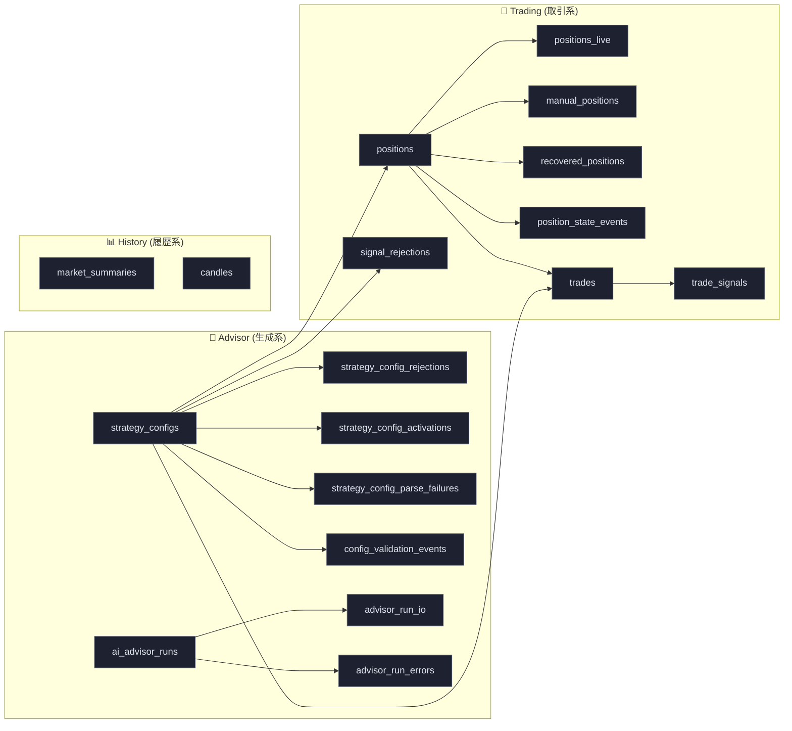
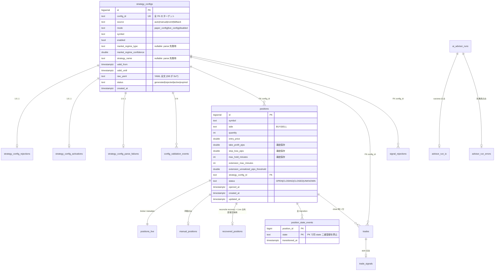

# fx-bot Data Model

Postgres 上の全テーブルとカラムの **何を、何のために** 保存しているかをまとめた。
スキーマ本体は [backend/migrations/0001_init.up.sql](../../backend/migrations/0001_init.up.sql) を正本とする。
このドキュメントは「なぜ」を補い、運用 / 開発時に DB を読むときの理解を助けるためのもの。

> 初期スキーマは `0001_init.up.sql` の 1 本 (paper 期間中に squash 済み)。以降の schema
> 変更は forward ALTER (`0002+`)。Live 投入後は squash 禁止 — 詳細は
> [MIGRATIONS.md](../workflows/MIGRATIONS.md) を参照。

---

## 設計原則 (= squash 時に揃えた 4 つ)

1. **NULL を junction table に追い出す**
   `nullable` カラムは「この属性は state によって有る/無い」を意味する。
   `positions.closing_at` のように特定 state でしか意味を持たない属性は
   junction table に分離する (= 行の存在自体が state を表す)。
2. **enum 列には全て CHECK 制約**
   port 定数や State パターンだけでは raw SQL / manual ops を防げない。
3. **クロステーブル参照は FK 必須**
   旧 schema の `strategy_config_id = 'manual' / 'recovered'` の sentinel
   文字列は廃止。manual / recovered は専用 junction (`manual_positions` /
   `recovered_positions`) に分離した。
4. **状態遷移は append-only ledger に記録**
   `position_state_events` が全 transition を記録、`positions.status` は
   最新 transition のキャッシュ。両者は同じ Tx で書く (app 層の責務、
   trigger 不使用 — flow をコード上で明示)。

### NULL が許される 4 列 (= 例外明記)

| カラム | 理由 |
|---|---|
| `strategy_configs.market_regime_type` | parse 失敗行 (parse_failures) でも main row を作るため |
| `strategy_configs.strategy_name` | 同上 |
| `config_validation_events.message` | pass 時はメッセージ無し |
| `signal_rejections.detail` | snapshot を含まないシンプル reject (legacy 経路) |

---

## 全体俯瞰

凡例: 全ての矢印は **実 FK 制約** (squash 後の方針)。junction table への
矢印は `ON DELETE CASCADE`、main 同士の参照 (positions → strategy_configs 等)
は `ON DELETE RESTRICT`。

### テーブル分類 (18 tables = 7 main + 11 junction)

| 分類 | テーブル |
|---|---|
| main (7) | `strategy_configs`, `config_validation_events`, `ai_advisor_runs`, `positions`, `trades`, `signal_rejections`, `market_summaries` |
| strategy junction (3) | `strategy_config_rejections`, `strategy_config_activations`, `strategy_config_parse_failures` |
| advisor junction (2) | `advisor_run_io`, `advisor_run_errors` |
| position junction (4) | `positions_live`, `manual_positions`, `recovered_positions`, `position_state_events` |
| trade junction (1) | `trade_signals` |
| 履歴 (1) | `candles` (junction なし。7 main + 11 junction の数え方では main 側に含める) |

* **書込みフロー (CQRS Command)**:
  advisor が config 生成 → `strategy_configs` insert + `config_validation_events`
  insert (4 行: schema/hard_limit/semantic/risk) → 受理時 `strategy_config_activations`
  insert + 既存 active を `expired` に降格 (partial unique index で同時 1 件保証)
  → bot がエントリ → `positions` + `positions_live` + `position_state_events(OPEN)`
  を 1 Tx → 決済時 `position_state_events(CLOSING → CLOSED)` + `trades` を 1 Tx。
* **読込みフロー (CQRS Query)**:
  `/api/positions` (OPEN/CLOSING positions) / `/api/trades` (30 日履歴) /
  `/api/status` (集計) / `/api/advisor/recent` (config 履歴) /
  `/api/market/state` (TF 別スナップショット)。

---

## strategy_configs (main)

advisor が生成した (auto / event / manual trigger)、または手で seed した
(`scripts/seed_active_config.sh`、`source='manual'`) 戦略設定の履歴。
**1 行 = 1 つの config**。`status='active'` の行が「今 bot が使っている設定」(起動時に読まれる)。

| カラム | 型 | 意味 |
|---|---|---|
| `id` | BIGSERIAL PK | 内部 ID |
| `config_id` | TEXT NOT NULL UNIQUE | YAML 上の論理 ID。`20260519-035006-usdjpy` 形式。**全 FK 参照はこの列** |
| `source` | TEXT NOT NULL CHECK | `auto` / `manual` / `event` / `fallback` |
| `mode` | TEXT NOT NULL CHECK | `paper_config` / `live_config` / `disabled`。**Live 判定はこの列のみ** (junction の存在で判定しない) |
| `symbol` | TEXT NOT NULL | `USD_JPY` etc. |
| `enabled` | BOOLEAN NOT NULL | `false` なら strategy 名と関係なく no-trade 扱い |
| `market_regime_type` | TEXT (nullable) | `range` / `trend_up` / `trend_down` / `volatile` / `unclear`。parse 失敗時のみ NULL |
| `market_regime_confidence` | DOUBLE NOT NULL DEFAULT 0 | 0.0〜1.0 |
| `strategy_name` | TEXT (nullable) | strategy engine に登録された戦略名 (`momentum_pullback` / `breakout_follow` / `ma_pullback` / `trend_follow` / `no_trade` 等)。parse 失敗時のみ NULL |
| `valid_from` / `valid_until` | TIMESTAMPTZ NOT NULL | 有効区間 (右開) |
| `raw_yaml` | TEXT NOT NULL | YAML 全文 (DB が SoT) |
| `status` | TEXT NOT NULL CHECK | `generated` / `rejected` / `active` / `expired` |
| `created_at` | TIMESTAMPTZ NOT NULL DEFAULT now() | DB insert 時刻 |

**制約**:
- `UNIQUE(config_id)`
- partial unique index `uniq_strategy_configs_active_per_symbol_mode`:
  `(symbol, mode) WHERE status='active'` — 同じ symbol/mode の active は同時 1 件のみ
- `idx_strategy_configs_status`

**Why important**:
- `raw_yaml` を含むので **過去の戦略を完全に再現可能** (audit + backtest replay の入口)
- `activated_at` は別 junction `strategy_config_activations` に分離 (status-dependent attribute)

---

## strategy_config_rejections (junction)

`status='rejected'` の rejection 詳細。1:0..1 (generated 行には対応なし)。

| カラム | 型 | 意味 |
|---|---|---|
| `config_id` | TEXT PK, FK → strategy_configs ON DELETE CASCADE | |
| `reason` | TEXT NOT NULL | reject 詳細 |
| `created_at` | TIMESTAMPTZ NOT NULL DEFAULT now() | |

---

## strategy_config_activations (junction)

`status='active'` になった時刻。1:0..1。
分離理由: state-dependent 列を main から外す方針。

| カラム | 型 | 意味 |
|---|---|---|
| `config_id` | TEXT PK, FK → strategy_configs ON DELETE CASCADE | |
| `activated_at` | TIMESTAMPTZ NOT NULL | 受理時刻 |

---

## strategy_config_parse_failures (junction)

YAML parse 失敗時の生入力。main は `status='rejected'` で確保した上で、
raw bytes をこの junction に逃がす (audit trail を残しつつ main は CHECK 制約に従う)。

| カラム | 型 | 意味 |
|---|---|---|
| `config_id` | TEXT PK, FK → strategy_configs ON DELETE CASCADE | |
| `raw_input` | TEXT NOT NULL | parse 失敗した生入力 |
| `created_at` | TIMESTAMPTZ NOT NULL DEFAULT now() | |

---

## config_validation_events (main)

Validator (`internal/config/validator.go`) の各段階の結果を pass/fail で記録。
**1 行 = 1 つの validation type の結果**。1 つの config 生成で 4 行入る。

| カラム | 型 | 意味 |
|---|---|---|
| `id` | BIGSERIAL PK | |
| `config_id` | TEXT NOT NULL, FK → strategy_configs ON DELETE CASCADE | |
| `validation_type` | TEXT NOT NULL CHECK | `schema` / `hard_limit` / `semantic` / `risk` |
| `status` | TEXT NOT NULL CHECK | `pass` / `fail` |
| `message` | TEXT (nullable) | fail 時の詳細 (`;` 連結)。pass 時は NULL |
| `created_at` | TIMESTAMPTZ NOT NULL DEFAULT now() | |

**Index**: `idx_validation_events_config_id`

---

## ai_advisor_runs (main)

Claude advisor を 1 回呼ぶたびの実行記録。**1 行 = 1 回の Claude 呼び出し**。
input/output の大 payload は junction に分離。

| カラム | 型 | 意味 |
|---|---|---|
| `id` | BIGSERIAL PK | |
| `run_id` | TEXT NOT NULL UNIQUE | 論理 run ID |
| `provider` | TEXT NOT NULL | `claude_cli` |
| `mode` | TEXT NOT NULL | 起動時の bot mode |
| `prompt_path` | TEXT NOT NULL | 渡した prompt ファイルパス |
| `status` | TEXT NOT NULL CHECK | `success` / `timeout` / `parse_error` / `cli_error` |
| `source` | TEXT NOT NULL CHECK | `auto` / `manual` / `event` |
| `started_at` / `finished_at` | TIMESTAMPTZ NOT NULL | |

**Index**: `idx_advisor_runs_started`, `idx_advisor_runs_source_started`

**Why**: list 表示時は main だけ読めば充分 (JSONB / TEXT 全文は scan しない)。
詳細は `advisor_run_io` / `advisor_run_errors` を join。

---

## advisor_run_io (junction)

advisor run が `status='success'` のときの input/output 全文。

| カラム | 型 | 意味 |
|---|---|---|
| `run_id` | TEXT PK, FK → ai_advisor_runs ON DELETE CASCADE | |
| `input_json` | JSONB NOT NULL | Claude に渡した summary 全文 |
| `output_yaml` | TEXT NOT NULL | Claude が返した YAML 全文 (parse 前) |

---

## advisor_run_errors (junction)

advisor run が失敗系 status (`timeout` / `parse_error` / `cli_error`) のときの message。

| カラム | 型 | 意味 |
|---|---|---|
| `run_id` | TEXT PK, FK → ai_advisor_runs ON DELETE CASCADE | |
| `message` | TEXT NOT NULL | エラー詳細 |

---

## positions (main)

エントリ済み (open or closed) ポジションの台帳。**1 行 = 1 ポジション**。

| カラム | 型 | 意味 |
|---|---|---|
| `id` | BIGSERIAL PK | 内部 ID (UI 等で参照) |
| `symbol` | TEXT NOT NULL | `USD_JPY` etc. |
| `side` | TEXT NOT NULL CHECK | `BUY` / `SELL` |
| `quantity` | INTEGER NOT NULL | 数量 (100 通貨 = 1 pip 1 円) |
| `entry_price` | DOUBLE NOT NULL | 約定価格 |
| `take_profit_pips` | DOUBLE NOT NULL | エントリ時の TP pips (凍結保存) |
| `stop_loss_pips` | DOUBLE NOT NULL | SL pips (凍結保存) |
| `max_hold_minutes` | INTEGER NOT NULL | 最大保有時間 (entry 時 snapshot)。例外的に operator が `ExtendPositionMaxHold` (延長ボタン) で後から加算できる唯一の snapshot 列 — config 変更では不可 |
| `extension_max_minutes` | INTEGER NOT NULL DEFAULT 0 | MaxHold 後の grace 上限。0=無効 |
| `extension_unrealized_pips_threshold` | DOUBLE NOT NULL DEFAULT 0 | 「横ばい」判定閾値 |
| `early_exit_window_minutes` | INTEGER NOT NULL DEFAULT 0 | MaxHold soft 手前の早期 exit 窓 (分)。0=無効 (migration 0002) |
| `early_exit_target_pips` | DOUBLE NOT NULL DEFAULT 0 | 早期 exit を発火させる PnL pips (通常はマイナス値) |
| `ratchet_arm_pips` | DOUBLE NOT NULL DEFAULT 0 | trailing TP の arm 閾値 (凍結保存)。peak がこの値に達したら armed。0=機能無効 (migration 0003) |
| `ratchet_giveback_pips` | DOUBLE NOT NULL DEFAULT 0 | trailing TP の giveback 幅 (凍結保存)。armed && (peak - 現 unrealized) ≥ giveback で MARKET close |
| `peak_unrealized_pips` | DOUBLE NOT NULL DEFAULT 0 | runtime state (snapshot ではない)。OnTick で `unrealized > peak` のとき UpdatePositionRatchetState が更新。monotonic increasing |
| `ratchet_armed` | BOOLEAN NOT NULL DEFAULT false | runtime state。peak が arm 閾値到達で true、以後 false に戻らない |
| `trough_unrealized_pips` | DOUBLE NOT NULL DEFAULT 0 | (migration 0009) trailing STOP (損切り側 ratchet) の runtime state。OnTick で `unrealized < trough` のとき UpdatePositionRatchetState が更新。monotonic decreasing。arm/giveback は利確側の `ratchet_arm_pips` / `ratchet_giveback_pips` を共用する (同 pips の mirror) |
| `loss_ratchet_armed` | BOOLEAN NOT NULL DEFAULT false | (migration 0009) runtime state。trough が `-ratchet_arm_pips` に達したら true、以後 false に戻らない。armed && (現 unrealized − trough) ≥ giveback で `ratchet_stoploss` MARKET close (満額 SL の broker OCO を待たず浅い傷で撤退) |
| `entry_fee_jpy` | DOUBLE NULL | (migration 0008) entry fill の broker 実報告手数料。NULL=未捕捉 (0008 以前の行 / paper)、0=broker が 0 と報告 — NULL と 0 を区別する。close 時に `trades.fee_jpy` (往復) へ合成 |
| `entry_spread_pips` | DOUBLE NULL | (migration 0008) 発注直前 ticker の実測スプレッド。NULL=未捕捉。live フォワードが backtest スプレッドモデル (`cmd/spread-calibrate` / `HourlySpread`) の較正データ源になる |
| `entry_slippage_pips` | DOUBLE NULL | (migration 0008) 符号付き adverse slippage = BUY: (fill−ask)/pip, SELL: (bid−fill)/pip。正=不利方向。NULL=未捕捉 (ticker 無し等) |
| `strategy_config_id` | TEXT NOT NULL, FK → strategy_configs ON DELETE RESTRICT | **常に実 config_id を指す** (sentinel 廃止) |
| `status` | TEXT NOT NULL CHECK | `OPEN` / `CLOSING` / `CLOSED` / `UNKNOWN` (latest-transition cache) |
| `opened_at` | TIMESTAMPTZ NOT NULL | エントリ時刻 |
| `created_at` / `updated_at` | TIMESTAMPTZ NOT NULL DEFAULT now() | |

**Index**: `idx_positions_symbol_status`

**account-wide 集計クエリ**: `CountOpenPositionsAllSymbols` ([queries/positions.sql](../../backend/internal/adapter/repository/queries/positions.sql)) は `WHERE status IN ('OPEN','CLOSING')` で全 symbol を合算。`recovered_positions` JOIN を **意図的に行わない** ため外部建玉 (`source=external_broker`) も count に含まれる — account-wide cap (`AccountMaxOpenPositions`) は margin protection が目的で、外部建玉も同じ margin pool を消費するため (per-symbol 集計の `ListOpenOrClosingPositions` は逆に外部建玉不可侵ポリシーで external を除外する)。

**保有上限の延長クエリ**: `ExtendPositionMaxHold` ([queries/positions.sql](../../backend/internal/adapter/repository/queries/positions.sql)) は `UPDATE ... SET max_hold_minutes = max_hold_minutes + $add WHERE id=$id AND status='OPEN' RETURNING max_hold_minutes, opened_at` (`:one`)。「延長ボタン」(`POST /api/positions/extend`) の経路。`status='OPEN'` のみ加算し、CLOSING/CLOSED/未知 id は 0 行 → `pgx.ErrNoRows` → repository wrapper が `(nil, nil)` を返す。`OnTick` が毎 tick で `max_hold_minutes` を読み直すので次 tick から新 deadline が効く。詳細は [port.md `保有上限の延長`](../architecture/layers/port.md)。

**重要な不変条件**:
建てた時点の `config_id / TP / SL / MaxHold / extension_* / early_exit_* / ratchet_arm_pips / ratchet_giveback_pips` を **凍結保存** する。
後で active config が切り替わっても既存ポジには影響しない。新規エントリだけが最新を使う。
`peak_unrealized_pips / ratchet_armed / trough_unrealized_pips / loss_ratchet_armed` は snapshot ではなく runtime state なので OnTick で更新可能 (`UpdatePositionRatchetState` が 4 値を 1 write で永続化)。
唯一の例外として `max_hold_minutes` は operator が `ExtendPositionMaxHold` (延長ボタン) で明示的に加算できる — これは config 由来の自動上書きではなく operator の意思決定なので不変条件と矛盾しない。

**Live close 不変条件**:
Live close saga は `position_state_events(CLOSING)` の append (= unique pk
`(position_id, 'CLOSING')` で claim) を Tx で行ってから broker action に進む。
二重 close 不可。

---

## positions_live (junction)

Broker-side metadata。paper / live どちらも broker が id を振るため両方で
populate する (PaperBroker も id を assign)。
`tp_order_id` / `sl_order_id` は Live の broker-side OCO 決済注文のみ非空、paper は空文字列。

**Live 判定**: この junction の存在ではなく `strategy_configs.mode = 'live_config'` で判定する。

| カラム | 型 | 意味 |
|---|---|---|
| `position_id` | BIGINT PK, FK → positions ON DELETE CASCADE | |
| `broker_position_id` | TEXT NOT NULL | broker assign |
| `tp_order_id` | TEXT NOT NULL | Live TP leg (paper は `''`) |
| `sl_order_id` | TEXT NOT NULL | Live SL leg (paper は `''`) |

---

## manual_positions (junction)

「manual trade コマンドでエントリした」事実だけを記録。
旧 schema の `strategy_config_id = 'manual'` sentinel を置き換え。

| カラム | 型 | 意味 |
|---|---|---|
| `position_id` | BIGINT PK, FK → positions ON DELETE CASCADE | |
| `created_at` | TIMESTAMPTZ NOT NULL DEFAULT now() | |

---

## recovered_positions (junction)

「reconciler が broker から取り込んだ」事実。
旧 schema の `strategy_config_id = 'recovered'` sentinel を置き換え。

| カラム | 型 | 意味 |
|---|---|---|
| `position_id` | BIGINT PK, FK → positions ON DELETE CASCADE | |
| `recovery_reason` | TEXT NOT NULL | 取り込み理由 (下表) |
| `recovered_at` | TIMESTAMPTZ NOT NULL | |

`recovery_reason` の正規値 ([backend/internal/port/repository.go](../../backend/internal/port/repository.go) — `RecoveryReasonToSource` で `PositionSource` に map):

| reason | 説明 | PositionSource | bot 管理 |
|---|---|---|---|
| `broker_naked_at_startup` | Paper mode 起動時に broker にあって DB に無い (DB クラッシュ / test reset) | `paper_recovered` | 通常通り管理 |
| `external_broker_adoption` | GMO アプリ等で直接建てた外部建玉を Live reconcile が自動採用 | `external_broker` | **管理しない (display-only)** |

Live mode の naked_broker_position は emergency_stop でなく `external_broker_adoption` reason で自動採用し、bot は触らない (詳細: [OPERATIONS_RUNBOOK.md §1](OPERATIONS_RUNBOOK.md) 不変条件「外部ポジは触らない不可侵 inventory」)。

---

## position_state_events (junction / ledger)

全 state 遷移の append-only 台帳。`(position_id, state)` が PK のため、
**同じ state に二度入れない** = terminal CLOSED の不変条件を DB レベルで強制。

| カラム | 型 | 意味 |
|---|---|---|
| `position_id` | BIGINT NOT NULL, FK → positions ON DELETE CASCADE | |
| `state` | TEXT NOT NULL CHECK | `OPEN` / `CLOSING` / `CLOSED` / `UNKNOWN` |
| `transitioned_at` | TIMESTAMPTZ NOT NULL | |
| PK | `(position_id, state)` | |

**Index**: `idx_position_state_events_position_time` (= `(position_id, transitioned_at DESC)`)

**Why**:
- `positions.status` と此処は同じ Tx で書く (app 層責務)。
- close saga: `ClaimForClose` が `INSERT (position_id, 'CLOSING')` で claim。
  UNIQUE 違反 = 既に CLOSING → 別 worker が握っている。

---

## trades (main)

決済済み取引の履歴。**1 行 = 1 つの完了したラウンドトリップ**。
決済時に `position_state_events(CLOSED)` + `positions.status=CLOSED` と
一緒に 1 Tx で insert。

| カラム | 型 | 意味 |
|---|---|---|
| `id` | BIGSERIAL PK | |
| `position_id` | BIGINT NOT NULL, FK → positions ON DELETE RESTRICT | |
| `strategy_config_id` | TEXT NOT NULL, FK → strategy_configs ON DELETE RESTRICT | |
| `symbol`, `side`, `quantity`, `entry_price` | (positions と同じスナップ) | |
| `exit_price` | DOUBLE NOT NULL | 決済価格 |
| `profit_loss_pips` | DOUBLE NOT NULL | 損益 (pip) |
| `profit_loss_jpy` | DOUBLE NOT NULL | 損益 (円)。**GROSS のまま維持**(既存集計と互換)。net = gross − `fee_jpy` + `swap_jpy` は導出側で計算 |
| `fee_jpy` | DOUBLE NOT NULL DEFAULT 0 | (migration 0007) GMO 手数料・往復 = entry leg (`positions.entry_fee_jpy`) + close leg (close fill の `Execution.FeeJPY` 実報告 or 0.002% 推定)。close saga / reconcile で `usecase/command/close_costs.go` (`composeLiveCloseCosts`、paper は `composePaperCloseCosts`) が合成 |
| `swap_jpy` | DOUBLE NOT NULL DEFAULT 0 | (migration 0007) 跨ぎスワップ (close fill の `Execution.SettledSwapJPY`、符号付き) |
| `fee_estimated` | BOOLEAN NOT NULL DEFAULT false | (migration 0007) true=いずれかの leg を 0.002% 推定で補完 (entry fee 未捕捉の旧建玉 / reconcile 推定 close) / false=両 leg とも broker 実報告値 |
| `close_reason` | TEXT NOT NULL CHECK | `take_profit` / `stop_loss` / `max_hold` / `early_exit` / `manual` / `reconcile_cold_close` / `ratchet_takeprofit` / `ratchet_stoploss` / `broker_close` / `session_flatten`。`ratchet_takeprofit` は migration 0004、`early_exit` (early-exit window 発火を `max_hold` と分離) は 0005、`broker_close` (TP/SL 非一致の broker-side close を reconcile が実 fill から復元) は 0006、`ratchet_stoploss` (損切り側 trailing = trough から giveback 戻りで浅く撤退) は 0010、`session_flatten` (毎朝の全玉強制手仕舞い) は 0011 で追加。集計クエリ `CountEarlyExitTradesSinceBySymbol` は `close_reason='early_exit'` を直接カウント |
| `opened_at` / `closed_at` | TIMESTAMPTZ NOT NULL | |
| `created_at` | TIMESTAMPTZ NOT NULL DEFAULT now() | |

**Index**: `idx_trades_closed_at`, `idx_trades_config_id`

**`reconcile_cold_close` の追加**: paper startup で broker に無い stale position を
synthetic close するときの reason。Live は同経路で **synthetic close 禁止** (= emergency_stop).

**`broker_close`** (migration 0006): reconcile が GMO `/v1/latestExecutions`
の実 close fill を復元できたが、その exit price が TP/SL の理論価格に一致しない close
(GMO アプリ手動決済・建値付近の broker 都合 close 等) を `classifyCloseReason` が分類する reason。
CHECK 制約に無い reason を返すと `CloseAndRecord` が制約違反で失敗し、`resolveAndRecordClose` が
synthetic 0-PnL (`reconcile_cold_close`) にフォールバック → 実際の損益が帳簿に乗らない。
**新しい close_reason を返すコードは、CHECK 制約の拡張 migration と同じ変更に入れる** (0004 / 0005 / 0006 はいずれもこの漏れの修正)。

**`ratchet_stoploss`** (migration 0009 列 + 0010 CHECK): trailing STOP (損切り側
ratchet) が返す close_reason。利確側 ratchet の鏡像で、含み損の trough (最悪値) が `-ratchet_arm_pips`
に達した後、trough から `ratchet_giveback_pips` 戻ったら満額 SL (broker OCO) を待たず浅い傷で撤退する。
「含み益まで行った玉が満額 SL まで往復する」非対称を圧縮する狙い。列追加 (0009) と CHECK 拡張 (0010) を
同じ変更で行う。

**`session_flatten`** (migration 0011): `llm_decision.session_flatten_jst` を設定したときの毎朝の
全玉強制手仕舞いが返す close_reason。GMO は早朝のロールオーバー時間帯にスプレッドを大きく広げるため、
そこで SL / ratchet が広スプレッドに機械的に発火するのを避け、手前の通常スプレッドで手仕舞う。
土曜の回が週末ギャップ回避を兼ねる。`evaluateSessionFlattenExit` (manage_open_positions_exits.go) が
evaluateExit の最優先で返し、窓 = 設定時刻から 30 分間 (JST 固定)・窓内に建てた玉は対象外。evaluator 追加と
CHECK 拡張 (0011) を同じ変更で行う。frontend 表示ラベルは「朝クローズ」(labels.ts)。

**risk gate 集計クエリ**: `closed_at >= since` を起点とした 2 経路の集計を
[queries/trades.sql](../../backend/internal/adapter/repository/queries/trades.sql) で定義。

| 用途 | account-wide (全 symbol 合算) | per-symbol filter |
|---|---|---|
| 件数 | `CountClosedSince` | `CountClosedBySymbolSince` |
| 損失合計 (JPY 絶対値、**NET**=`(profit_loss_jpy − fee_jpy + swap_jpy) < 0` の符号反転。GMO 手数料込みの損失額で日次 cap を判定する = gross より保守的) | `SumClosedLossJPYSince` | `SumClosedLossJPYBySymbolSince` |
| 一覧 (closed_at DESC、LIMIT 付き) | `ListTradesClosedSince` | `ListTradesClosedBySymbolSince` |

per-symbol query は `WHERE symbol = $1 AND closed_at >= $2`、account-wide は
`WHERE closed_at >= $1` だけ。多 symbol 化以降は per-symbol cap を `*BySymbol`、
account-wide cap (`AccountMaxDailyLossJPY`) を unsuffixed で読み分ける
([port.md](../architecture/layers/port.md) `多 symbol risk gate 用の per-symbol / account-wide 集計分離` 参照)。

---

## trade_signals (junction)

「auto trade だった」事実 + signal_id。manual close は対応行なし (= 存在自体が
「auto trade」のフラグ)。

| カラム | 型 | 意味 |
|---|---|---|
| `trade_id` | BIGINT PK, FK → trades ON DELETE CASCADE | |
| `signal_id` | TEXT NOT NULL | strategy 生成 signal ID |

---

## signal_rejections (main)

Risk Gate が「エントリ条件は満たしたが現在の状態でリスク的に却下」したケース。
**1 行 = 1 つの reject イベント**。

| カラム | 型 | 意味 |
|---|---|---|
| `id` | BIGSERIAL PK | |
| `strategy_config_id` | TEXT NOT NULL, FK → strategy_configs ON DELETE RESTRICT | reject 時点の active config |
| `reason` | TEXT NOT NULL | `cooldown_after_loss` / `daily_loss_cap` / `max_open_positions` / `outside_allowed_hours_jst` etc. |
| `detail` | JSONB (nullable) | snapshot + signal の strategy/side 等。シンプル reject では NULL |
| `created_at` | TIMESTAMPTZ NOT NULL DEFAULT now() | |

**Index**: `idx_signal_rejections_created`

**Why**: プロンプト改善ループの主要入力。advisor へのフィードバックに使う。

---

## market_summaries (main)

advisor サイクルが使った MarketSummary の履歴。INSERT するのは AdvisorCycle だけで (`advisor_cycle.go`)、1 分ごとの minuteLoop は
`runtime/ai_input/latest_summary.json` を書くだけ。`ai_advisor` が off ならこのテーブルは空のままで、`cmd/spread-calibrate`
(と backtest の `-spread-file`) には入力が無い。

| カラム | 型 | 意味 |
|---|---|---|
| `id` | BIGSERIAL PK | |
| `symbol` | TEXT NOT NULL | |
| `summary_window` | TEXT NOT NULL | `1h` / `6h` / `24h` |
| `raw_json` | JSONB NOT NULL | summary 全体 |
| `created_at` | TIMESTAMPTZ NOT NULL DEFAULT now() | |

**Index**: `idx_market_summaries_symbol` (= `(symbol, created_at DESC)`)

---

## candles (main)

OHLCV bar の永続化。**1 行 = 1 本のローソク足**。

| カラム | 型 | 意味 |
|---|---|---|
| `id` | BIGSERIAL PK | |
| `symbol` | TEXT NOT NULL | |
| `timeframe` | TEXT NOT NULL CHECK | `1m` / `5m` / `15m` / `1h` |
| `opened_at` | TIMESTAMPTZ NOT NULL | bar 開始時刻 |
| `open` / `high` / `low` / `close` | DOUBLE NOT NULL | OHLC |
| `volume` | DOUBLE NOT NULL DEFAULT 0 | 出来高 |
| `created_at` / `updated_at` | TIMESTAMPTZ NOT NULL DEFAULT now() | |

**制約**: `UNIQUE(symbol, timeframe, opened_at)` — UPSERT 用

**Index**: `idx_candles_lookup` (= `(symbol, timeframe, opened_at DESC)`)

---

## 永続化されないが重要なファイル / メモリ状態

DB の外にある状態(`runtime/emergency_stop.flag`・`runtime/ai_input/`・`ActiveConfigHolder`・`Counters`・Aggregator など)は [RUNTIME.md §4・§5](RUNTIME.md) が正。DB の active 行と同期する
`configs/strategy_config.active.yaml`(artifact。SoT は DB)は [CONFIG.md](CONFIG.md) の表を参照。

---

## マイグレーション履歴

> 各 migration の詳細は [workflows/MIGRATIONS.md §10](../workflows/MIGRATIONS.md) が正。

| # | 内容 |
|---|---|
| 0001 | **初期スキーマ** (squash 済み) — 18 tables (7 main + 11 junction)、nullable / sentinel 撤廃、State パターン + append-only ledger |
| 0002 | `positions.early_exit_window_minutes` / `early_exit_target_pips` |
| 0003 | `positions` に ratchet TP 4 列 (`ratchet_arm_pips` / `ratchet_giveback_pips` / `peak_unrealized_pips` / `ratchet_armed`) |
| 0004 | `trades.close_reason` CHECK に `ratchet_takeprofit` |
| 0005 | `trades.close_reason` CHECK に `early_exit` |
| 0006 | `trades.close_reason` CHECK に `broker_close` |
| 0007 | `trades.fee_jpy` / `swap_jpy` / `fee_estimated` |
| 0008 | `positions.entry_fee_jpy` / `entry_spread_pips` / `entry_slippage_pips` |
| 0009 | `positions.trough_unrealized_pips` / `loss_ratchet_armed` (損切り側 ratchet) |
| 0010 | `trades.close_reason` CHECK に `ratchet_stoploss` |
| 0011 | `trades.close_reason` CHECK に `session_flatten` |

> **Live 投入後は squash 禁止**。以降の schema 変更は forward ALTER (`0002+`)
> として追加する。新規 query を sqlc で追加するフローは
> [MIGRATIONS.md](../workflows/MIGRATIONS.md) を参照。

---

## ER 図 (要約)

**参照ルール**:
- 全クロステーブル参照は **実 FK 制約** (旧 schema の文字列参照は廃止)。
- `ON DELETE CASCADE` は junction (削除は main と一緒に消える)。
- `ON DELETE RESTRICT` は main 同士 (`positions.strategy_config_id` 等 —
  config を消すと過去のポジ/取引が孤児化するため禁止)。
