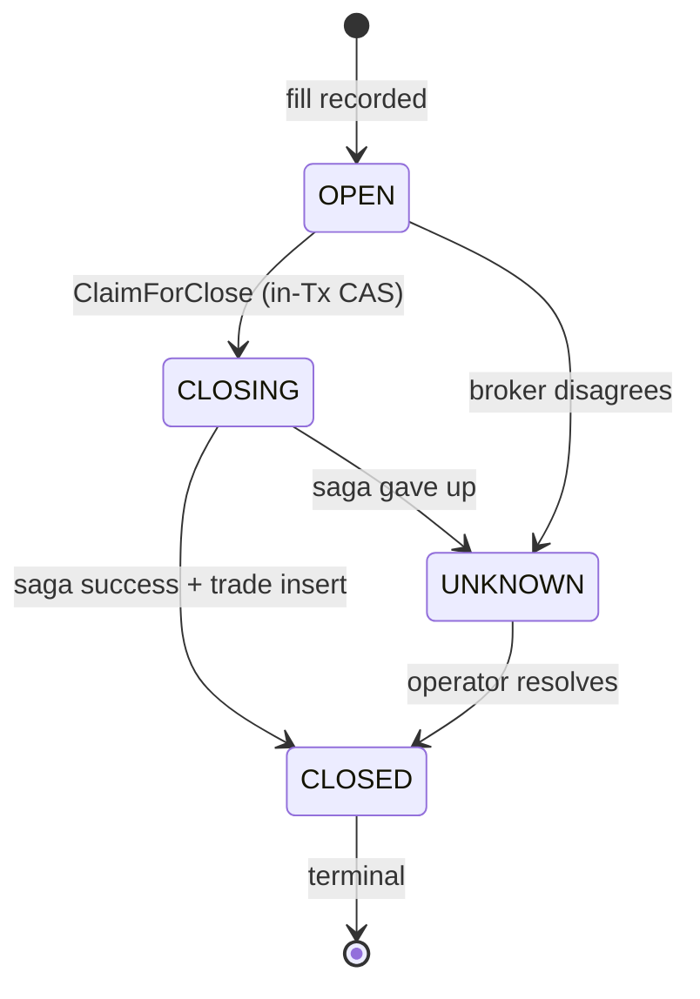

# Position State Machine

Position の lifecycle と `position_state_events` ledger の仕様。
**State パターン** で domain 層に実装、**append-only ledger** で DB 層に保存する。
2 層で互いに補完し、片方の bypass (raw SQL / bad call-site) を防ぐ。

実装本体:

- domain: [backend/internal/domain/position/state.go](../../backend/internal/domain/position/state.go)
- DB: `position_state_events` table — schema は
  [backend/migrations/0001_init.up.sql:244-254](../../backend/migrations/0001_init.up.sql#L244-L254),
  概念図は [DATA_MODEL.md](DATA_MODEL.md#position_state_events-junction--ledger)

---

## 1. 4 つの State

| State | 意味 | 何が真か |
|---|---|---|
| `OPEN` | 約定済 / at-risk | TP/SL leg が broker (Live) または bot monitor (Paper) に張られている |
| `CLOSING` | close saga 開始 | `ClaimForClose` の in-Tx CAS で claim 済み。新規 close 不可 |
| `CLOSED` | terminal | trade 行が存在、PnL 確定。reconcile 対象外 |
| `UNKNOWN` | DB / broker 不整合 (予約) | schema と domain に定義だけある。現在のコードはこの state に遷移させない (解決できない不整合は CLOSING のまま emergency_stop で人に渡す) |

---

## 2. 許可される遷移

```
OPEN    ──► CLOSING (claim-for-close)
OPEN    ──► UNKNOWN (broker out of sync)
CLOSING ──► CLOSED  (saga success)
CLOSING ──► UNKNOWN (saga を打ち切る)
CLOSED  ──► (terminal — 出口なし)
UNKNOWN ──► CLOSED  (operator-resolved, fill 発見)
```

逆向き / 同一 state への遷移は **全て禁止**。UNKNOWN 絡みの遷移は domain の State パターンでは許可されているが、
現在のコードは UNKNOWN に遷移させない (§1)。



---

## 3. 2 層の enforce

### (a) DB 層 — `position_state_events`

```sql
CREATE TABLE position_state_events (
    position_id     BIGINT NOT NULL REFERENCES positions(id) ON DELETE CASCADE,
    state           TEXT NOT NULL CHECK (state IN ('OPEN','CLOSING','CLOSED','UNKNOWN')),
    transitioned_at TIMESTAMPTZ NOT NULL,
    PRIMARY KEY (position_id, state)
);
```

- **PK `(position_id, state)`** が「同じ state に 2 回入れない」を強制 = terminal CLOSED の不変条件 + 二重 close 防止。
- raw SQL や manual ops でこの table を bypass しようとしても CHECK + PK で拒否される。

### (b) app 層 — status の CAS

repository の書込みは、遷移元の status を条件にした UPDATE (CAS) で行う: `ClaimForClose` は
`WHERE status='OPEN'` で OPEN → CLOSING を取り、`CloseAndRecord` は `WHERE status='CLOSING'` で
CLOSING → CLOSED にする。条件に合わなければ 0 行更新で false を返し、呼び出し側は skip する
(別経路が先に決済していた、など)。

遷移の行列 (§2) は domain の `State.CanTransitionTo(next)` (`backend/internal/domain/position/state.go`) に
仕様として書き、テストで固定している。repository はこれを呼ばない (書込み前の検査は上の CAS が担う)。

DB 層は bypass (raw SQL・手作業) を、app 層は call-site のロジックの誤りを止める。**両層を冗長と見なして 1 つに統合してはいけない**。

---

## 4. `positions.status` との同期

`positions.status` は **最新 transition のキャッシュ** (= ledger の終端値)。
ledger と `status` は **同じ Tx で書く** (app 層の責務、trigger 不使用):

```go
tx.Exec("INSERT INTO position_state_events(position_id, state, transitioned_at) VALUES ($1, $2, $3)", id, next, now)
tx.Exec("UPDATE positions SET status = $1, updated_at = $2 WHERE id = $3", next, now, id)
```

trigger を使わない理由: state 遷移はビジネスロジックの中心 — コードに明示することで
review / debug 時に流れが追える。同期は integration test で検証する。

---

## 5. 代表的な遷移経路

### 5.1 Auto entry → TP fire (normal happy path)

```
[entry]
  INSERT positions (status='OPEN')
  INSERT position_state_events (OPEN)
  INSERT positions_live (broker_position_id, tp_order_id, sl_order_id)

[bot が決済 (paper の TP/SL・MaxHold・ratchet 等) — close saga]
  -- Tx 1: claim
  INSERT position_state_events (CLOSING)
  UPDATE positions SET status='CLOSING' WHERE status='OPEN'
  -- Tx の外: broker の脚 cancel + 成行決済 + 約定照会 (Live のみ。Paper は PaperBroker)
  -- Tx 2: CloseAndRecord
  INSERT position_state_events (CLOSED)
  UPDATE positions SET status='CLOSED' WHERE status='CLOSING'
  INSERT trades (close_reason='take_profit' 等)
  INSERT trade_signals (trade_id, signal_id)              -- auto のみ

[Live で broker の OCO が先に約定]
  reconcile が TP/SL 脚の約定を解決し、同じく CLOSING → CLOSED + trades を記録する
```

### 5.2 Manual close

`trade_signals` 行が無いので「manual close」と判別できる。
それ以外は 5.1 と同じ流れ。`close_reason='manual'`。

### 5.3 Broker out of sync (reconcile・Live)

```
[reconcile detects: DB OPEN, broker no position]
  TP/SL 脚の実約定を解決できた
    → CLOSING → CLOSED + INSERT trades (close_reason='take_profit'|'stop_loss'|'broker_close')
  まだ解決できない
    → grace の間は DEFER (次の pass で再試行)
    → grace 後、現在値が OCO 水準を明確に越えていれば、その水準で推定記帳
    → それ以外は hard window 超過で emergency_stop (0 円の架空決済は作らない)
```

emergency_stop の後は operator が broker 側の約定を確認して記帳する。

### 5.4 Paper startup recovery

Paper のみ。Live の起動時は実約定を解決して記録し、解決できなければ runtime reconcile に回す (5.3。synthetic close はしない)。

paper の起動時は、reconcile の前に DB の OPEN 行を PaperBroker に戻す (`restorePaperPositions`、
`backend/cmd/bot/main.go`)。OPEN の建玉はそのまま管理が続く。synthetic close になるのは、
**CLOSING のまま残った行 (止まった close saga の残骸) だけ**:

```
[paper startup: DB CLOSING, PaperBroker に無い]
  -- claim は飛ばして CloseAndRecord を直接呼ぶ (reconcile_handlers.go)
  INSERT position_state_events (CLOSED)
  UPDATE positions SET status='CLOSED' WHERE status='CLOSING'
  INSERT trades (close_reason='reconcile_cold_close', 建値で 0 円)
```

`recovered_positions` はこの経路では書かない (書くのは broker の建玉を DB に取り込む adopt 経路だけ)。

---

## 6. 不変条件 (= test で守る)

| # | 不変条件 | enforce 方法 |
|---|---|---|
| I1 | 1 つの position は同じ state に 2 度入らない | DB PK `(position_id, state)` |
| I2 | terminal CLOSED から先の遷移は存在しない | DB PK + status の CAS (CLOSED を条件にする UPDATE が無い)。仕様は `ClosedState.CanTransitionTo() = false` (テストで固定) |
| I3 | `positions.status` と最新 ledger entry は常に一致 | 同一 Tx で両方書く + integration test で diff チェック |
| I4 | 不正な state 文字列は domain 層で reject | `ParseState` が error を返す → repository scan が fail loudly |
| I5 | OPEN を skip して直接 CLOSED 不可 | `CloseAndRecord` の CAS が `status='CLOSING'` を条件にする。仕様は `OpenState.CanTransitionTo(ClosedState{}) = false` (テストで固定) |

---

## 7. 関連 docs

- [DATA_MODEL.md](DATA_MODEL.md) — `position_state_events` を含む schema 全体
- [MIGRATIONS.md](../workflows/MIGRATIONS.md) — 状態遷移を変更する場合の migration ルール
- [layers/domain.md](../architecture/layers/domain.md) — State パターンの位置づけ
